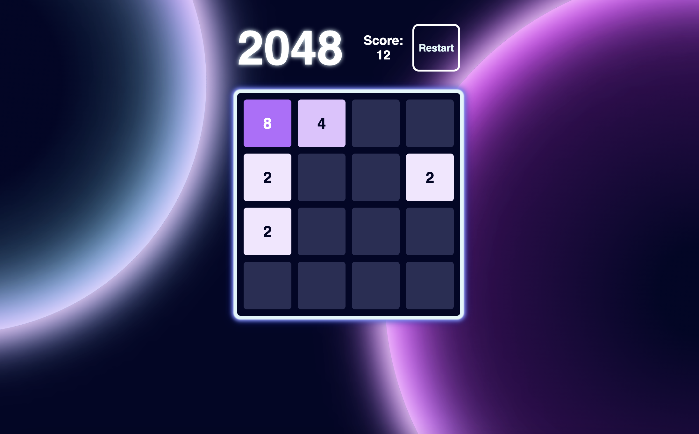

# 2048 Game

  

## General Description

  A web-based version of a globally popular game, featuring a simple dark neon cosmic design. Optimized for desktop screens and navigated by keyboard presses, this rendition retains the classic gameplay while utilizing JavaScript classes to implement the game logic. Enjoy the added charm of distant planets drifting in the background as you increase your score.

## Demo

- <a href="https://akozlovska.github.io/2048/" target="_blank">Live Demo</a>

## Tech Stack

  
  

## Setup and Usage

  
Setup Instructions

  <ol>
    <li>Clone the repository
      <pre><code>git clone https://github.com/akozlovska/2048.git</code></pre>
    </li>
    <li>Navigate to the project directory
      <pre><code>cd 2048</code></pre>
    </li>
    <li>Install dependencies
      <pre><code>npm install</code></pre>
    </li>
    <li>Open the landing page to view it in the browser
      <pre><code>npm start</code></pre>
    </li>
  </ol>

## License

This project is licensed under the MIT License.
